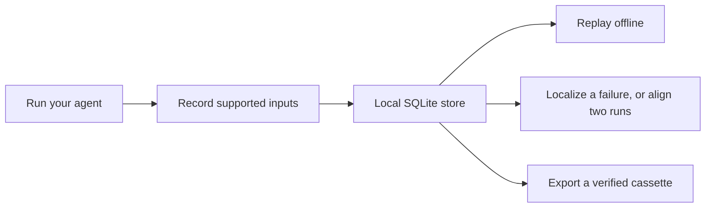

# Tracewake

**Record. Replay. Find the divergence.**

Tracewake makes AI agent runs inspectable and repeatable. Record the model calls, tool results, files, time, and other nondeterministic inputs an agent consumes. Replay them offline with the network blocked. Given a failing run, locate the step where it went irrecoverably wrong — no reference run, no model call — and get a reliability band for how much to trust the answer.

The repo ships the full stack: a Python library and CLI, a Go control plane with versioned contracts, a TypeScript dashboard, a held-out evaluation on published agent-failure benchmarks, and Terraform for AWS. Everything works locally without a hosted service.

## At a glance

* Record and replay agent runs offline
* Localize likely failure steps without an LLM
* Optionally request a separate LLM advisory from a hosted or local endpoint
* Compare trajectories and export verified cassettes

```sh
git clone https://github.com/amln19/tracewake.git
cd tracewake
uv sync
uv run python examples/demo.py
# Run tests (PYTHONHASHSEED=0 enforces deterministic replay hashing)
PYTHONHASHSEED=0 uv run pytest
```

The demo is offline and needs neither an API key nor a model server. It records two short tool-calling runs, replays one, and prints a real divergence report using the dependency-free lexical aligner. Python 3.13 or newer is required. To install from a checkout with `pip`, run `python -m pip install .`.

```sh
tracewake record -- python agent.py
tracewake replay <run>
tracewake localize <bad-run>
tracewake diff <good-run> <bad-run> --lexical
tracewake view <good-run> <bad-run> --lexical
```

`localize` needs only the failing run. `diff` and `view` need a passing run too: they align both trajectories even when the action sequences differ in length, then write a terminal or HTML comparison.

## Why this exists

Agent failures are expensive to reproduce. The model said something different, a tool returned something different, the clock moved, or a retry took a new path. Logs tell you that two runs differ. They do not replay the run, and they do not tell you which step made the failure irrecoverable.

Tracewake is a local workflow for that:



Use it for regression tests, incident investigation, agent evaluation, or sharing a validated recording with a teammate.

## Library

Use the same agent code for recording and replay. The model and tools below are Tracewake adapters around your client and dispatcher.

```python
import tracewake

with tracewake.record("fix-off-by-one") as rec:
    model = rec.model(
        provider="acme", model_id="acme-1",
        create_fn=client.create, stream_fn=client.stream,
    )
    agent.run(task, model, rec.tools(client.dispatch), rec.clock, rec.fs)
    rec.outcome(status="ok")
    run_id = rec.run_id

with tracewake.replay(run_id) as rep:
    model = rep.model(provider="acme", model_id="acme-1")
    agent.run(task, model, rep.tools(), rep.clock, rep.fs)
```

The CLI can also wrap a program: `tracewake record -- python agent.py` exposes the active session as `tracewake.current()`. Replay-only sessions block networking even when configuration tries to disable it.

[`examples/openai_agent.py`](examples/openai_agent.py) is a runnable, no-network tool-calling example using the message and `tool_call_id` shape used by OpenAI-compatible clients. Replace its deterministic `create_fn` with an adapter that returns `tracewake.ModelResponse`.

For pytest, the included `tracewake_cassette` fixture defaults to replay-only (`none`), so a test fails when it needs an unrecorded interaction.

## What it records

Tracewake records inputs the agent consumes through its documented boundary:

* model calls, including stream chunk boundaries
* tool calls and results
* `Session.fs` operations
* supported clock, randomness, UUID, and environment reads

A parallel tool-call batch is a partial order. Tracewake preserves intra-batch position and does not treat completion arrival order as a stable sequence. Requests match on `model` and `messages_hash` by default. Ordinal matching is available only when explicitly requested; it is never a silent fallback.

| Mode | Behavior |
| --- | --- |
| `once` | Replay an existing cassette; record if none exists. |
| `none` | Replay only; a missing request errors and networking is blocked. |
| `new_episodes` | Replay matching requests and record misses. |
| `all` | Always record. |

Redaction is on by default. It scrubs configured secret values, known credential headers and environment names, and home paths.

A run lives in a local SQLite store plus a content-addressed blob store. Export, verify, and import do not need a service:

```sh
tracewake export <run> -o cassette
tracewake verify cassette
tracewake import cassette
```

`verify` checks the cassette header and versions, event sequence and schemas, derived hashes, the logical run digest, and every referenced blob. Import validates completely before making a run visible.

## Analysis

| Task | Command |
| --- | --- |
| Locate where a failing run went wrong | `tracewake localize <bad>` |
| Compare two trajectories | `tracewake diff <good> <bad> --lexical` |
| Produce an HTML comparison | `tracewake view <good> <bad> --lexical -o out.html` |
| Export OTLP/JSON GenAI spans | `tracewake otel <run> -o trace.json` |
| Export token use as pprof | `tracewake pprof <run> --view tokens -o tokens.pb.gz` |
| Replay with selected context removed | `tracewake intervene <run> --drop-tag file_read --from-step 4 -- <agent>` |

`localize` reports a step and a reliability class. `diff` leads with localization, then shows the alignment — where the two runs stopped agreeing. `view` writes the same comparison as a self-contained HTML report.

`--lexical` is the dependency-free alignment profile. The richer local embedding path is optional: run `uv sync --extra embeddings` and omit `--lexical`; the pinned model may download on first use.

### Optional LLM advisory

`localize` and `diff` can optionally request a natural-language advisory from any OpenAI-compatible endpoint (hosted services or local models via Ollama / vLLM):

```sh
export TRACEWAKE_LLM_BASE_URL=http://127.0.0.1:11434/v1
export TRACEWAKE_LLM_MODEL=my-model

tracewake localize <bad-run> --llm
tracewake diff <good-run> <bad-run> --lexical --llm
```

The advisory is explicitly non-authoritative: it supplies a conversational explanation, cited evidence steps, and model confidence alongside the deterministic `localize-v1` result. Replay-only sessions remain strictly network-blocked.

## Evaluation

Tracewake localizes where a failing run went irrecoverably wrong from that run alone. No reference run, no alignment step, no LLM call. The rule is structural: reading a file is recoverable; writing one the run did not create for itself is not. It was tuned on 107 labelled training trajectories, frozen, and scored once on 262 held-out trajectories it has never seen — including all 102 of [RootSE](https://arxiv.org/abs/2605.26563), labelled by the TrajAudit authors:

| Pool | n | Exact | ±2 | ±5 |
| --- | --- | --- | --- | --- |
| SWE-agent | 101 | 32.7% | 51.5% | 62.4% |
| OpenHands | 59 | 44.1% | 59.3% | 69.5% |
| **RootSE** (externally labelled) | 102 | **17.6%** | **45.1%** | **57.8%** |
| **all** | **262** | **29.4%** | **50.8%** | **62.2%** |

The pooled row includes in-house-labelled data; RootSE is the independent external evaluation and the more conservative result.

Chance rates for the same population are 5%, 22%, and 40%.

On RootSE's exact-step metric, the published field looks like this:

| Method | Exact match | Cost per instance |
| --- | --- | --- |
| TrajAudit (with reference) | 56.6% | ~122k tokens |
| All-at-once prompting | 31.9% | LLM |
| Step-by-step prompting | 23.3% | LLM |
| **Tracewake (this rule)** | **17.6%** | **0** |
| Binary search over steps | 15.8% | LLM rollouts |
| Random attribution | 5.4% | 0 |

The comparison figures come from the RootSE evaluation reported by the [TrajAudit paper](https://arxiv.org/abs/2605.26563); Tracewake's row is the local, zero-inference-cost structural baseline. Tracewake provides an empirical non-LLM baseline for this task that outperforms binary search and random attribution at zero inference cost. On short traces that contain a commitment, localization lands within two steps of the label 88% of the time.

Two label-free facts — whether the run wrote to anything it did not create, and whether the trace exceeds 18 steps — sort every failure into one of five reliability classes. `localize` reports the class so you know when to trust the step and when to treat the answer as unreliable.

Full methodology, label protocol, and comparison to alignment-based readouts are in [`contracts/divergence.md`](contracts/divergence.md). [`corpus/`](corpus/README.txt) holds the labelled packets and dataset prerequisites.

To score the implementation users install, run:

```sh
uv run --group bench python -m bench.score_shipped
```

## What's in this repository

| Path | What it is |
| --- | --- |
| [`tracewake/`](tracewake/) | Python library and CLI: recording, replay, alignment, localization, export |
| [`controlplane/`](controlplane/) | Go HTTP service: auth, leases, transactional outbox, fencing, tenant isolation |
| [`dashboard/`](dashboard/) | TypeScript UI for the local hosted stack |
| [`contracts/`](contracts/) | Versioned bundle, API, worker, lifecycle, and schema contracts |
| [`deploy/aws/`](deploy/aws/) | Terraform for AWS: ECS, RDS, S3, SQS, WAF, CloudWatch |
| [`evidence/`](evidence/) | Reproducible operational harness (ingestion, fencing, isolation, restore) |
| [`bench/`](bench/) and [`corpus/`](corpus/) | Held-out evaluation against SWE-agent, OpenHands, and RootSE labels |
| [`examples/`](examples/) | Offline demo and OpenAI-shaped integration |

Python is authoritative for analysis semantics. Unsupported contract versions are rejected rather than silently reinterpreted. `align-v2` is frozen compatibility behavior; a materially different analysis algorithm requires a new versioned profile.

## Hosted analysis

Local recording, replay, comparison, verification, import, and export do not require a hosted service. The repository also ships a Go control plane and Python worker for analyzing already-recorded bundles at scale. It does not execute arbitrary uploaded agent code.

The control plane owns tenant authorization and lifecycle. PostgreSQL is authoritative for state. Object storage holds immutable bundles and artifacts. Jobs use workspace-scoped idempotency, database leases, retries, cancellation, a transactional outbox, reconciliation, and stale-attempt fencing so exactly one result survives worker loss.

With Go, PostgreSQL 17, Node, npm, and `uv` installed:

```sh
scripts/local-control-plane
```

That starts PostgreSQL, the control plane, a Python worker, and the dashboard at `http://127.0.0.1:8080`. Docker is an alternative: `docker compose up --build`. The AWS environment is documented in [`deploy/aws/README.md`](deploy/aws/README.md).

An end-to-end evidence harness drives bundle ingestion, mandatory validation, burst load, worker kill and recovery, stale completion rejection, tenant isolation, backup/restore, and local independence. Reproduce it with `uv run python -m evidence --output evidence/results` (about ten minutes; needs `go`, `uv`, and local PostgreSQL 17). The methodology and output format are in [`evidence/README.md`](evidence/README.md).

## Development

```sh
uv sync
# Replay requires PYTHONHASHSEED=0 to disable hash randomization and ensure byte-identical determinism
PYTHONHASHSEED=0 uv run --python 3.13 pytest
uv run --python 3.13 python -m tracewake.contracts --output contracts/schemas/v1 --check
uv run --python 3.13 python -m contracttest.generate_fixtures --output contracttest/fixtures/v1 --check
(cd contracttest/go && go test ./...)
(cd controlplane && go test ./...)
uv build
```

CI runs the Python suite on Ubuntu and macOS, Go tests (including race, fuzz, and PostgreSQL lifecycle), contract fixtures, the dashboard unit and Playwright tests, and Terraform validate. `tracewake diff` and `view` need `uv sync --extra embeddings` unless you pass `--lexical`. Replay needs `PYTHONHASHSEED=0`; the CLI sets it for wrapped processes.

The control plane's lifecycle, fencing, and end-to-end tests need PostgreSQL. Point them at a database to run the full suite, as CI does:

```sh
(cd controlplane && TRACEWAKE_TEST_DATABASE_URL=postgres://localhost/tracewake go test ./...)
```

## Limits

Tracewake records through its documented agent boundary — not arbitrary syscalls, native code, or subprocess I/O. Redaction scrubs known secret patterns; it does not guarantee every sensitive value is gone. Hosted analysis accepts recorded bundles under the `align-v2` and `localize-v1` profiles only.

## Further reading

* [`contracts/README.md`](contracts/README.md) — bundle, public API, worker, lifecycle, persistence, and threat-model contracts
* [`contracts/divergence.md`](contracts/divergence.md) — localization rule, measurements, and evaluation protocol
* [`contracts/align-v2.md`](contracts/align-v2.md) — exact hosted alignment profile
* [`evidence/README.md`](evidence/README.md) — operational harness and measurement methodology
* [`deploy/aws/README.md`](deploy/aws/README.md) — deployment, retention, and recovery
* [`examples/demo.py`](examples/demo.py) — the offline end-to-end demo

## License

[MIT](LICENSE)
