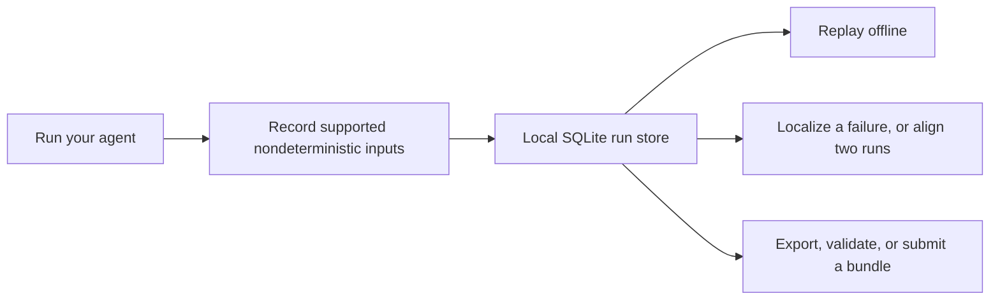

# Tracewake

**Record. Replay. Find the divergence.**

Tracewake is a local-first Python tool for making agent behavior inspectable and repeatable. It records the nondeterministic inputs an agent consumes through its supported adapters—model responses, tool results, files, time, randomness, UUIDs, and environment reads—then replays those inputs from a cassette with network access blocked. Given a failing run, it locates the step where that run went irrecoverably wrong, using only that run and no model call, and says how much to trust the answer. Given a passing run as well, it aligns both trajectories and shows them side by side.

The name is deliberate: a run leaves an execution *wake* of model calls, tool interactions, state changes, and decisions. Tracewake captures that wake so you can trace behavior back to what happened.

The divergence engine and its evaluation against externally labelled benchmarks are the substantive part of this project. See [Evaluation](#evaluation).

```sh
git clone https://github.com/amln19/tracewake.git
cd tracewake
uv sync
uv run python examples/demo.py
```

The demo is offline and needs neither an API key nor a model server. It records two short tool-calling runs, replays one, then prints a real divergence report. To install Tracewake from a checkout with `pip`, run `python -m pip install .`; it requires Python 3.13 or newer.

Common CLI commands:

```sh
tracewake record -- python agent.py
tracewake replay <run>
tracewake diff <good-run> <bad-run>
tracewake localize <bad-run>
tracewake view <good-run> <bad-run>
```

## Why use it?

Agent failures are often expensive to reproduce: the model response changed, a tool returned something different, the clock moved, or a retry took a new path. Logs alone can tell you that two runs differ, but not reliably compare their changing-length action sequences.

Tracewake provides a small, local workflow:



It is useful for regression tests, incident investigation, agent evaluation, and sharing a validated recording with a teammate or a separate analysis service.

## Quick start

### Wrap an existing program

```sh
work="$(mktemp -d)"
uv run tracewake record --store "$work/store" --name smoke -- python -c \
  'import tracewake; s = tracewake.current(); print(s.clock.time()); s.outcome(status="ok")'
uv run tracewake replay smoke --store "$work/store"
```

Both commands print the same recorded clock value. The CLI exposes the active session through `tracewake.current()` for programs it wraps. Replay-only sessions block networking even when process-wide or per-session configuration tries to disable it.

For pytest, the included `tracewake_cassette` fixture defaults to replay-only (`none`), so a test fails when it needs an unrecorded interaction.

### Integrate the library

Use the same agent code for recording and replay. The model and tools below are Tracewake adapters around your client and dispatcher.

```python
import tracewake

with tracewake.record("fix-off-by-one") as rec:
    model = rec.model(
        provider="acme", model_id="acme-1",
        create_fn=client.create, stream_fn=client.stream,
    )
    agent.run(task, model, rec.tools(client.dispatch), rec.clock, rec.fs)
    rec.outcome(status="ok")
    run_id = rec.run_id

with tracewake.replay(run_id) as rep:
    model = rep.model(provider="acme", model_id="acme-1")
    agent.run(task, model, rep.tools(), rep.clock, rep.fs)
```

[`examples/openai_agent.py`](examples/openai_agent.py) is a runnable, no-network tool-calling example using the message and `tool_call_id` shape used by OpenAI-compatible clients. Replace its deterministic `create_fn` with an adapter for a real client that returns `tracewake.ModelResponse`.

### Compare a good and bad run

```sh
uv run tracewake diff good bad --store .tracewake --lexical
uv run tracewake view good bad --store .tracewake --lexical -o comparison.html
```

`diff` prints the alignment and selected divergence; `view` writes a self-contained side-by-side HTML report. `--lexical` uses the dependency-free profile. The richer local embedding path is optional: install it with `uv sync --extra embeddings`.

## What Tracewake records and replays

Tracewake records inputs that an agent consumes through its documented boundary:

* model calls, including stream chunk boundaries;
* tool calls and results;
* `Session.fs` operations;
* supported clock, randomness, UUID, and environment reads.

It preserves intra-batch position for parallel tool calls, while treating a parallel batch as a partial order rather than pretending completion arrival order is stable. Requests match on `model` and `messages_hash` by default. Ordinal matching is available only when explicitly requested; it is never a silent fallback.

The record modes are deliberately small:

| Mode | Behavior |
| --- | --- |
| `once` | Replay an existing cassette; record if none exists. |
| `none` | Replay only; a missing request errors and networking is blocked. |
| `new_episodes` | Replay matching requests and record misses. |
| `all` | Always record. |

Redaction is on by default. It redacts configured secret values, known credential headers and environment names, and home paths. That is useful hygiene, not a guarantee that arbitrary source, binary data, private repositories, or unknown secrets are safe to distribute. `tracewake record --no-redact` disables it and records that choice in the cassette.

## Analyzing a recorded run

`localize` needs only the failing run and reports a step with a reliability class. `diff` and `view` need a passing run too, and align the two even when they have insertions, deletions, or repeated actions. Both give a debugging lead with context, rather than claiming to prove a root cause. Tracewake can also:

| Task | Command |
| --- | --- |
| Locate where a failing run went wrong | `tracewake localize <bad>` |
| Compare two trajectories | `tracewake diff <good> <bad> --lexical` |
| Produce an HTML comparison | `tracewake view <good> <bad> --lexical -o out.html` |
| Export OTLP/JSON GenAI spans | `tracewake otel <run> -o trace.json` |
| Export token use as pprof | `tracewake pprof <run> --view tokens -o tokens.pb.gz` |
| Replay with selected context removed | `tracewake intervene <run> --drop-tag file_read --from-step 4 -- <agent>` |

Intervention replays model output but re-executes the world. Its free replay prefix therefore ends at the first re-executed tool output that is not byte-identical to the recording. Provenance tags on `Message` objects group HTML context and pprof leaves; untagged blocks become one bucket.

## Local artifacts and reproducibility

The normal local store is SQLite plus a content-addressed blob store. A run can be moved or reviewed without a service:

```sh
tracewake export <run> -o cassette
tracewake verify cassette
tracewake import cassette
```

`verify` checks the cassette header and versions, dense event sequence, event schemas, derived request hashes, logical run digest, canonical paths, and every referenced blob's presence, digest, and size without changing the store. Import validates completely before making a run visible; export re-verifies stored blob bytes before publishing its destination.

Two distinct digests matter:

* the logical run digest identifies canonical event content;
* the bundle digest identifies the exact transport bytes.

`tracewake.bundle` can package a validated cassette as deterministic, uncompressed USTAR bundle v1 for the hosted path. The format, size limits, and validation rules are documented in [`contracts/bundle-v1.md`](contracts/bundle-v1.md).

## Hosted analysis

Tracewake's local recording, replay, comparison, verification, import, and export do not require a hosted service. The repository also includes a Go control plane and Python worker for analyzing already-recorded bundles. It does not execute arbitrary uploaded agent code.

The hosted workflow is:

1. Upload a deterministic bundle directly to artifact storage using a short-lived grant.
2. A mandatory Python validation job checks it before the run becomes usable.
3. Submit `diff`, `otlp`, or `pprof` work for a ready run. `diff` uses the dependency-free, versioned `align-v1` profile.
4. A worker produces immutable, attempt-scoped artifacts. The control plane registers exactly one result only if the current lease remains valid.

PostgreSQL is authoritative for hosted lifecycle state; object storage holds immutable bundles and artifacts; queue delivery is at-least-once notification, not authority. Jobs use workspace-scoped idempotency, database leases, retries, cancellation, transactional outbox publication, reconciliation, and stale-attempt fencing. The complete contract set is in [`contracts/`](contracts/README.md).

### Run the local hosted stack

With Go 1.26, PostgreSQL 17, Node 26, npm, and `uv` installed:

```sh
scripts/local-control-plane
```

It starts PostgreSQL, the control plane, a Python worker, and the dashboard at `http://127.0.0.1:8080`. Read the one-time workspace token from the private credentials file printed by the command, then:

```sh
export TRACEWAKE_REMOTE_URL=http://127.0.0.1:8080
export TRACEWAKE_TOKEN=<token-from-credentials-file>

tracewake remote upload run.bundle.tar
tracewake remote runs
tracewake remote analyze pprof <run-id> --idempotency-key spend-1
tracewake remote job <job-id>
tracewake remote artifacts <job-id>
tracewake remote download <artifact-id> -o tokens.pb.gz
```

Docker is an alternative: run `docker compose up --build`, then read `/run/tracewake/credentials.json` from the `controlplane` container. Remove the disposable stack and its retained data with `docker compose down --volumes`.

The AWS Terraform environment is optional and requires an account, state backend, certificate, and cost decision. Its deployment, retention, recovery, and threat boundaries are described in [`deploy/aws/README.md`](deploy/aws/README.md).

## Evaluation

Tracewake locates where a failing run went irrecoverably wrong using only that run. There is no reference run and no model call. `tracewake localize <run>` reports a step and a reliability class. The full definition, every measurement, and the limits are in [`contracts/divergence.md`](contracts/divergence.md).

Reading a file is recoverable; writing one is not. Three facts each bound the point of no return from above: the run changed something it did not create, its actions became exactly periodic to the end, or it stopped doing anything it does not also repeat. The earliest of the three is the tightest bound, so that is what gets reported. Nothing here is weighted or fitted.

The four labelled sets differ in who wrote the labels, which agent framework produced the runs, and how long the failures are:

| Set | Pairs | Labelled by | Agent framework | Median failing trace |
| --- | --- | --- | --- | --- |
| OpenHands dev | 40 | Tracewake | OpenHands | 18 steps |
| OpenHands held-out | 40 | Tracewake | OpenHands | 18 steps |
| RootSE | 58 | TrajAudit authors | four scaffolds | 51 steps |
| nebius | 40 | Tracewake | SWE-agent | 56 steps |

The two OpenHands halves come from one 80-pair set, split with a fixed seed before any design work and never re-split. The development half was open during design; the held-out half was scored at the end. Both are shown because the comparison between them is the check: a method fitted to its development data would score lower on the half it never saw.

RootSE is the only set labelled by people outside this project, and the only one spanning several agent frameworks. Its failures and nebius's run about three times longer than the OpenHands ones, which is the regime where every method here is weakest.

Within ±2 steps of the label, on all 178 pairs:

| Rule | OpenHands dev | OpenHands held-out | RootSE | nebius | pooled |
| --- | --- | --- | --- | --- | --- |
| `earliest_bound` | 25/40 | 25/40 | 27/58 | 19/40 | **96/178 = 54%** |
| `first_commitment` | 25/40 | 23/40 | 27/58 | 15/40 | 90/178 = 51% |
| `align-v1` (alignment readout) | 18/40 | 18/40 | 5/58 | 4/40 | 45/178 = 25% |
| constant 10, fitted on development data | 22/40 | 21/40 | 9/58 | 5/40 | 57/178 = 32% |

Read the columns rather than the pooled total. The sets are not equivalent evidence, and the pool is dominated by whichever one happens to be largest.

Two label-free facts sort the pairs into classes ranging from 87% to 21% accurate: whether the run committed at all, and whether the trace exceeds 18 steps. The ordering holds inside each dataset, not only in the pool:

| Answering | Coverage | Accuracy |
| --- | --- | --- |
| everything | 100% | 54% |
| drop `silent-long` | 89% | 58% |
| also drop `commit-long-many` | 42% | **80%** |
| `commit-short` only | 17% | 87% |

A long run that never changed anything pre-existing is right about a fifth of the time. Tracewake reports that class as unreliable instead of dressing it up as an answer.

### Compared with published methods

The literature reports *exact* step match. On RootSE that is 21% here, against 56.6% for [TrajAudit](https://arxiv.org/abs/2605.26563) at roughly 122k tokens per instance, 31.9% for all-at-once prompting, and 15.8% for binary search over steps. That puts it between the field's search baselines and its weaker prompting baselines, at zero marginal cost, and well behind the state of the art.

The accuracy is not what stands out. No published work reports a purely non-LLM baseline for this task at all. A reference-based variant was built, measured, and withdrawn once it turned out to win only on the scaffold it was tuned against; a prediction registered in advance to explain those wins was then falsified on fresh data. Around thirty other candidate signals were tried and lost. [`contracts/divergence.md`](contracts/divergence.md) records each one and why.

[`corpus/`](corpus/README.txt) describes the labelled packets, the seeded development and held-out partition, and the per-pair prediction sheets. The benchmark commands live in [`bench/`](bench/). Running `python -m bench.pooled` reproduces both tables above.

## Operational evidence

Tracewake includes a local end-to-end harness that drives bundle ingestion, mandatory validation, burst load, worker loss, stale completion, retry exhaustion, artifact contradictions, outbox backlog, database outage, tenant isolation, backup/restore, and local independence. It uses one control-plane process, one worker, PostgreSQL 17, Go 1.26.5, and Python 3.13.14 on one macOS arm64 machine. These are correctness and single-machine observations, not scale claims.

Reproduce the retained local run (about ten minutes; it needs `go`, `uv`, and local PostgreSQL 17):

```sh
uv run python -m evidence --output evidence/results
```

The raw telemetry and methodology are retained under [`evidence/`](evidence/README.md).

### Measured behaviour

| Measurement | Value |
| --- | --- |
| 10 bundles uploaded and validated | p50 879 ms, p95 950 ms |
| 24 diff analyses submitted at once | drained in 1.47 s |
| Their end-to-end latency | p50 1153 ms, p95 1237 ms |
| One analysis every two seconds for a minute | 30 of 30 succeeded, p50 460 ms |
| Killed worker to fenced attempt | 60.4 s, the attempt lease |
| Killed worker to committed result | 70.3 s |
| Spans emitted | 1986 across 636 traces |
| Traces spanning both languages | 78, up to 20 spans each |
| Distinct metric series | 103 |

The local stack polls the outbox once per second, so it dominates these latency figures. Under the sustained rate, the mean was 634 ms across its first half and 396 ms across its second; the one worker kept up rather than falling behind. Every injected failure condition moved the metric its configured deployment alarm watches. CloudWatch's evaluation engine and platform metrics are not observable in this local harness.

### On a deployed environment

One deployment of the same release and fault workflow is retained in [`evidence/results/aws/measurements.json`](evidence/results/aws/measurements.json). It is evidence from one environment, not a capacity study.

| Measurement | Value |
| --- | --- |
| Notification latency, diff (5 samples) | 38–820 ms |
| Notification latency, mandatory validation (6 samples) | 81–923 ms |
| Fastest diff, request to terminal state | 371 ms |
| Worker partitioned to attempt fenced | 82 s, bounded by the 60 s lease |
| Fenced attempt to alarm in ALARM | 2 min 12 s |
| Database point-in-time restore to available | 15 min 30 s |

Three real-fault alarms entered `ALARM`: an attempt-lease loss under worker partition, a reconciler failure during a database reboot, and worker capacity reduced to zero. Both partitioned jobs recovered on their second attempt and committed one authoritative result. SQS long-polling gave a 38 ms best notification latency, unlike the local polling floor. Scaling behavior and cost remain unmeasured.

### Lifecycle coverage

The local evidence run exercises this complete lifecycle; the named observations are retained in `evidence/results/measurements.json`.

| Step | Recorded observation |
| --- | --- |
| Upload a deterministic bundle | `ingestion` |
| Observe mandatory validation before it is usable | `ingestion` |
| Submit an idempotent `align-v1` diff | `analysis_load` |
| Observe a claimed attempt reporting progress | `worker_recovery.progress_while_running` |
| Kill the active worker and wait for fencing | `worker_recovery.kill_to_fence_seconds` |
| Observe retry and the replacement result | `worker_recovery.succeeded_attempts` |
| Send a late completion from the old worker | `late_completion.stale_attempt_requests` |
| Repeat the idempotent request | `idempotent_replay` |
| Inspect artifact identity, provenance, and audit | `result_provenance` |
| Attempt a cross-workspace read | `tenant_isolation` |
| Record and replay with no service running | `local_independence` |

## Versioned formats and further reading

Event schema 3, SQLite store schema 3, cassette directory format 1, bundle format 1, result schemas, and hosted APIs are separate versioned contracts. Unsupported versions are rejected rather than silently reinterpreted. Start with:

* [`contracts/README.md`](contracts/README.md) — bundle, public API, worker, lifecycle, persistence, and threat-model contracts.
* [`contracts/align-v1.md`](contracts/align-v1.md) — exact hosted alignment profile.
* [`evidence/README.md`](evidence/README.md) — reproducible operational harness and what it does not measure.
* [`deploy/aws/README.md`](deploy/aws/README.md) — operator requirements, deployment, retention, deletion, and recovery.
* [`examples/openai_agent.py`](examples/openai_agent.py) and [`examples/demo.py`](examples/demo.py) — runnable integration and end-to-end demo.

## Development

```sh
uv sync
PYTHONHASHSEED=0 uv run --python 3.13 pytest
python -m tracewake.contracts --output contracts/schemas/v1 --check
python -m contracttest.generate_fixtures --output contracttest/fixtures/v1 --check
(cd contracttest/go && go test ./...)
(cd controlplane && go test ./...)
uv build
```

`tracewake diff` and `view` need `uv sync --extra embeddings` unless you pass `--lexical`. Replay needs `PYTHONHASHSEED=0`; the CLI sets it for wrapped processes, and the library explains the requirement elsewhere. The offline replay gate records a real socket through the CLI, then proves the replay process makes zero connections.

## Limits

Tracewake is intentionally not a universal recorder or a security sandbox. It does not claim complete syscall, native-code, subprocess, or arbitrary filesystem interception. It cannot prove redaction removed every sensitive value. A divergence report is a debugging lead, not a causal diagnosis: `localize` lands within two steps of a human label about half the time, and reports which cases it cannot localise at all. Hosted analysis currently accepts recorded bundles only, and the hosted profile is `align-v1`; it does not remotely execute untrusted agent code.

## License

[MIT](LICENSE)
